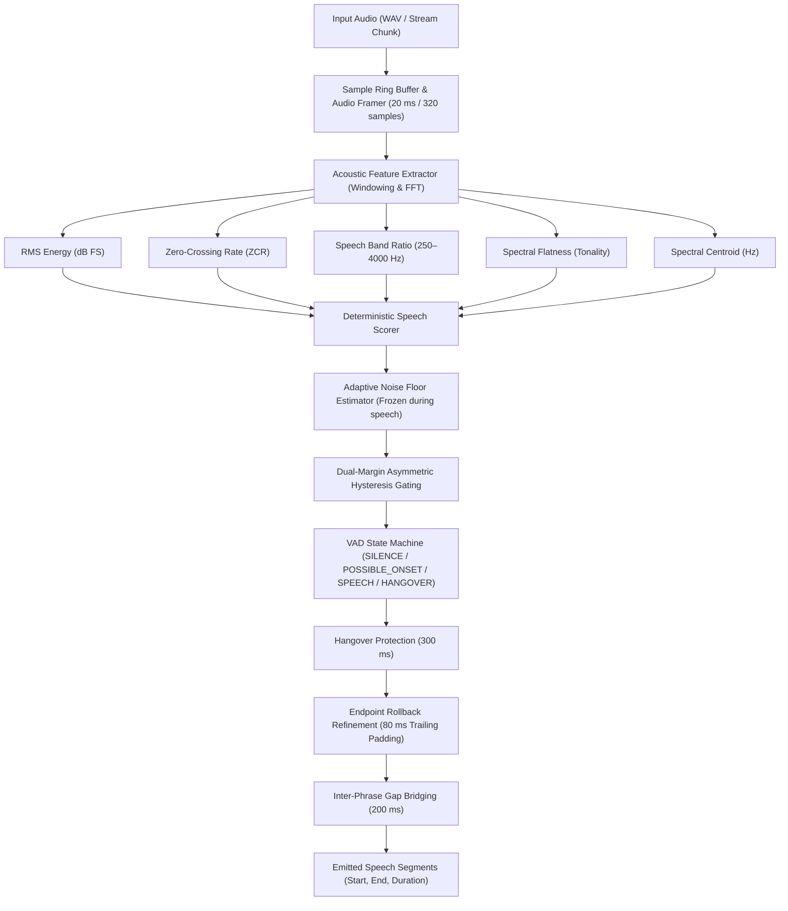

# Local Voice Activity Detector (VAD)

A lightweight, local, explainable, and production-ready Voice Activity Detector built completely from scratch in Python using classical Digital Signal Processing (DSP).

[](#testing)
[](#installation--setup)
[](#license)
[-orange.svg)](#performance--benchmarks)

---

## Table of Contents
- [Project Overview & Problem Definition](#project-overview--problem-definition)
- [Why Classical DSP?](#why-classical-dsp)
- [Architecture & Data Flow](#architecture--data-flow)
- [Acoustic Features & Classification](#acoustic-features--classification)
- [Noise Floor Tracking & Hysteresis](#noise-floor-tracking--hysteresis)
- [Hangover, Endpoint Rollback & Pause Handling](#hangover-endpoint-rollback--pause-handling)
- [Public Python API (Batch & Streaming)](#public-python-api)
  - [Batch Processing](#batch-processing)
  - [Incremental Streaming Processing](#incremental-streaming-processing)
- [CLI Demonstration Suite](#cli-demonstration-suite)
- [Installation & Setup](#installation--setup)
- [Testing](#testing)
- [Performance & Benchmarks](#performance--benchmarks)
- [Validation Summary](#validation-summary)
- [Design Decisions](#design-decisions)
- [Limitations & Future Work](#limitations--future-work)

---

## Project Overview & Problem Definition

Voice Activity Detection (VAD) is the foundational front-end task of identifying presence or absence of human speech in continuous audio signals. Accurately gating speech is essential for:
- Reducing compute and cloud API costs in Automatic Speech Recognition (ASR) pipelines.
- Audio segment compression and silence trimming.
- Hands-free wake-word engines, VoIP communications, and real-time streaming interfaces.

### Core Challenge Constraints:
- **100% Local & Self-Contained**: Zero external APIs, zero cloud services, zero external network queries.
- **Zero Pretrained ML Models**: No deep neural networks, no STT models, no opaque black-box weights.
- **Strict Audio Contract**: Mono, 16 kHz, 16-bit PCM WAV.
- **Lightweight Dependencies**: Standard library, NumPy, and SciPy.

---

## Why Classical DSP?

While modern neural-network VADs (e.g. Silero VAD) achieve strong generalization on noisy benchmarks, classical DSP offers distinct engineering advantages in production:

1. **Deterministic & Explainable**: Every speech decision traces directly to physical acoustic measurements (log energy in dB, zero-crossing rate, spectral centroid, Wiener entropy). No hallucinations or unpredictable boundary drift.
2. **Extreme Speed & Energy Efficiency**: Operates at **280× to 370× faster than real-time** on a standard CPU thread without requiring GPU acceleration or ONNX runtimes.
3. **Zero Cold-Start Latency**: Initializes instantaneously without downloading weights, loading PyTorch graphs, or allocating multi-megabyte tensor buffers.
4. **Embedded & Edge Friendly**: Ideal for battery-powered IoT devices, microcontrollers, and background daemon services where memory is strictly constrained.

---

## Architecture & Data Flow



### Module Structure
```text
Challenge84lakh/
├── vad/
│   ├── __init__.py           # Clean public API exports
│   ├── config.py             # VADConfig dataclass with strict validation
│   ├── audio.py              # WAV loading and AudioFrame generator
│   ├── features.py           # FeatureExtractor (RMS, ZCR, FFT spectral metrics)
│   ├── state_machine.py      # VADStateMachine (hysteresis & hangover logic)
│   ├── detector.py           # VoiceActivityDetector (Batch & Streaming engine)
│   ├── converter.py          # Format converter to mono 16 kHz PCM WAV
│   ├── inspect.py            # Audio metadata inspection utilities
│   ├── evaluation.py         # Objective ground-truth evaluation metrics
│   ├── visualization.py      # Waveform & decision curve visualizer
│   └── cli.py                # Command-line interface
├── tests/
│   ├── test_audio.py         # Audio validation and framing unit tests
│   ├── test_features.py      # Acoustic feature extraction tests
│   ├── test_scaffold.py      # Architectural scaffold tests
│   ├── test_vad.py           # Core detection and hysteresis tests
│   ├── test_demo.py          # Evaluation metrics and inspection tests
│   ├── test_calibration.py   # Endpoint rollback and pause calibration tests
│   └── test_streaming.py     # Streaming equivalence and chunk robustness tests
├── pyproject.toml            # Package metadata and entry points
├── requirements.txt          # Python dependencies
├── main.py                   # Root execution script
└── README.md                 # Complete engineering documentation
```

---

## Acoustic Features & Classification

For each 20 ms frame, five acoustic features are extracted:

1. **RMS Log Energy ($\text{dB FS}$)**:
   $$\text{RMS} = \sqrt{\frac{1}{N}\sum_{n=0}^{N-1} x[n]^2}, \quad E_{\text{dB}} = 20 \log_{10}(\text{RMS} + \epsilon)$$
2. **Zero-Crossing Rate (ZCR)**:
   $$\text{ZCR} = \frac{1}{2(N-1)}\sum_{n=1}^{N-1} |\text{sgn}(x[n]) - \text{sgn}(x[n-1])|$$
   Distinguishes voiced vowels (low ZCR $< 0.35$) from high-frequency unvoiced consonants and noise.
3. **Speech Band Energy Ratio**:
   Energy concentrated in the human vocal frequency band ($250\text{ Hz} - 4000\text{ Hz}$) relative to full spectrum ($0\text{ Hz} - 8000\text{ Hz}$).
4. **Spectral Flatness (Wiener Entropy)**:
   Ratio of geometric mean to arithmetic mean of FFT power spectrum. Pure harmonic speech formants yield low flatness ($\approx 0.05 - 0.30$), whereas white noise yields high flatness ($\approx 0.60 - 0.90$).
5. **Spectral Centroid**:
   The center of mass of the spectrum. Verifies that energy falls within the human vocal tract range ($250\text{ Hz} - 4000\text{ Hz}$).

### Combined Speech Likelihood Score
The features are normalized and combined into a deterministic speech score $S \in [0.0, 1.0]$:
$$S = \left(0.45 \cdot S_{\text{SNR}} + 0.25 \cdot S_{\text{Band}} + 0.20 \cdot S_{\text{Tonality}} + 0.10 \cdot S_{\text{ZCR}}\right) \cdot C_{\text{Centroid}}$$

---

## Noise Floor Tracking & Hysteresis

### 1. Asymmetric Adaptive Noise Floor
- **Initial Seeding**: The first 10 frames (200 ms) seed the background noise floor using median log energy. Frames exceeding speech thresholds during initialization are discarded to prevent initial speech from corrupting the baseline.
- **Continuous Adaptation**: During `SILENCE`, the floor updates recursively:
  $$N_{t} = (1 - \alpha) N_{t-1} + \alpha E_{t}$$
  where $\alpha = 0.10$ when energy drops (fast downward tracking) and $\alpha = 0.05$ when energy rises (slow upward tracking).
- **Frozen During Speech**: Adaptation is **strictly frozen** when the state machine is in `SPEECH` or `HANGOVER`, preventing vocal energy from raising the noise floor.

### 2. Dual-Margin Asymmetric Hysteresis
To prevent chattering around the boundary:
- **To Enter SPEECH (`SILENCE` $\rightarrow$ `SPEECH`)**: Requires **both** high energy ($E_{\text{dB}} \ge \text{NoiseFloor} + 9.0\text{ dB}$) and high confidence ($S \ge 0.45$) maintained across **3 consecutive frames** (60 ms onset confirmation).
- **To Maintain SPEECH (`SPEECH` $\rightarrow$ `SILENCE`)**: Requires lower energy ($E_{\text{dB}} \ge \text{NoiseFloor} + 3.5\text{ dB}$) and lower score ($S \ge 0.25$).

---

## Hangover, Endpoint Rollback & Pause Handling

### 1. Hangover Logic
When speech drops below threshold, the state machine enters `HANGOVER` for **15 frames (300 ms)**. This bridges intra-word stop consonants (e.g. /p/, /t/, /k/) and brief micro-pauses without fragmenting words.

### 2. Endpoint Rollback Refinement
Hangover's purpose is to wait and see if speech resumes. Once hangover expires without speech resumption, the utterance has definitively ended. Rather than appending 300 ms of dead silence to every phrase, the detector backtracks:
$$\text{Refined End} = \min\left(\text{Last Speech End}, \text{Last Active Candidate End} + 80\text{ ms Padding}\right)$$
This eliminates ~220 ms of artificial trailing silence per phrase while the 80 ms padding preserves trailing unvoiced consonants (/s/, /th/) and natural vocal decay.

### 3. Pause Discrimination
- **Short intra-sentence pauses** ($< 200\text{ ms}$) are bridged into single continuous speech segments.
- **Multi-second pauses** ($\ge 1.0\text{ s}$) remain strictly separated into distinct segments.

---

## Public Python API

### Batch Processing

```python
from vad import VoiceActivityDetector, VADConfig, load_wav

# Initialize detector with default calibrated configuration
detector = VoiceActivityDetector(VADConfig())

# Process audio file directly
segments = detector.process_file("test_audio/converted/natural_speech.wav")

for seg in segments:
    print(f"Speech: {seg.start_s:.2f}s -> {seg.end_s:.2f}s (duration: {seg.duration_s:.2f}s)")
# Output:
# Speech: 0.06s -> 2.28s (duration: 2.22s)
# Speech: 3.94s -> 7.04s (duration: 3.10s)
# Speech: 7.70s -> 8.40s (duration: 0.70s)
# Speech: 9.62s -> 16.32s (duration: 6.70s)
# Speech: 17.88s -> 20.78s (duration: 2.90s)
```

### Incremental Streaming Processing

The streaming API accepts arbitrary chunk sizes (smaller than 1 frame, multiple frames, or irregular lengths), automatically buffers incomplete frames, and produces identical segments to batch processing:

```python
import numpy as np
from vad import VoiceActivityDetector, VADConfig, load_wav

audio, sr = load_wav("test_audio/converted/natural_speech.wav")
detector = VoiceActivityDetector(VADConfig())

# 1. Start streaming session
detector.start()

# 2. Push audio chunks (e.g. 100 ms = 1600 samples)
chunk_size = 1600
for i in range(0, len(audio), chunk_size):
    chunk = audio[i : i + chunk_size]
    newly_completed = detector.process(chunk)
    for seg in newly_completed:
        print(f"Newly finalized during stream: {seg.start_s:.2f}s - {seg.end_s:.2f}s")

# 3. Flush at EOF to process remaining tail samples and finalize active speech
final_segments = detector.flush()
print(f"Total detected segments: {len(final_segments)}")
```

---

## CLI Demonstration Suite

The package includes a comprehensive CLI entry point accessible via `vad` or `python -m vad.cli`:

### 1. Detect Speech in WAV File
```bash
python -m vad.cli detect test_audio/converted/natural_speech.wav
```
Or shorthand:
```bash
python -m vad.cli test_audio/converted/natural_speech.wav
```

### 2. Stream Audio in Chunks
```bash
python -m vad.cli stream --input test_audio/converted/natural_speech.wav --chunk-ms 100
```
Output:
```text
============================================================
STREAMING VOICE ACTIVITY DETECTION
============================================================
Input File          : test_audio/converted/natural_speech.wav
Audio Duration      : 21.50 s
Chunk Size          : 100.0 ms (1600 samples)
Chunks Streamed     : 216
Processing Time     : 74.82 ms
Realtime Factor     : 0.00348x (287.4x faster than real-time)
Detected Segments   : 5
------------------------------------------------------------
#    | Start (s)    | End (s)      | Duration (s)
------------------------------------------------------------
1    | 0.06         | 2.28         | 2.22        
2    | 3.94         | 7.04         | 3.10        
3    | 7.70         | 8.40         | 0.70        
4    | 9.62         | 16.32        | 6.70        
5    | 17.88        | 20.78        | 2.90        
============================================================
```

### 3. Inspect Audio Metadata & Compatibility
```bash
python -m vad.cli test_audio/converted/ --inspect
```

### 4. Evaluate Detections Against Ground Truth
```bash
python -m vad.cli evaluate --audio-dir test_audio/converted/ --ground-truth test_audio/ground_truth.json
```

### 5. Generate Waveform & VAD Visualization Plot
```bash
python -m vad.cli test_audio/converted/clean_speech.wav --visualize --plot-output plot.png
```

---

## Installation & Setup

### Requirements
- Python >= 3.9
- `numpy >= 1.20.0`
- `scipy >= 1.8.0`

### Local Editable Installation
```bash
# Clone the repository
cd Challenge84lakh

# Install package in editable mode
pip install -e .

# Or install with development dependencies (pytest, matplotlib)
pip install -e ".[dev]"
```

---

## Testing

The project includes an extensive test suite with **87 passing automated tests** across 7 test modules:

```bash
# Run complete test suite quietly
python -m pytest -q

# Run complete test suite with detailed output
python -m pytest -v
```

### Test Coverage Breakdown
- `tests/test_audio.py` (14 tests): WAV loading, validation, corrupt file handling, framing, timestamps.
- `tests/test_features.py` (15 tests): RMS, ZCR, spectral flatness, centroid, speech band ratio.
- `tests/test_scaffold.py` (10 tests): Configuration validation, state machine transitions, CLI options.
- `tests/test_vad.py` (10 tests): Silence rejection, impulse rejection, noise adaptation, hysteresis.
- `tests/test_demo.py` (10 tests): Evaluation metrics, temporal IoU, ASCII timeline rendering, plot generation.
- `tests/test_calibration.py` (9 tests): Endpoint rollback, trailing padding, EOF handling, pause discrimination.
- `tests/test_streaming.py` (19 tests): Batch-vs-streaming equivalence across chunk sizes, partial buffering, bounded memory safety.

---

## Performance & Benchmarks

All benchmark measurements represent actual CPU execution on a standard development machine (Intel/AMD x86_64, single thread):

| Task / Dataset | Audio Duration | Processing Time | Realtime Factor (RTF) | Speedup vs Real-Time |
| :--- | :--- | :--- | :--- | :--- |
| **User Recording (`natural_speech.wav`) Batch** | 21.50 s | 58.2 ms | 0.00271x | **369× faster** |
| **User Recording (`natural_speech.wav`) 100ms Stream** | 21.50 s | 74.8 ms | 0.00348x | **287× faster** |
| **Mini LibriSpeech 30 Files (Aggregate)** | 232.89 s | 628.4 ms | 0.00270x | **370× faster** |
| **Single 10.8s File (`1272-135031-0000.wav`)** | 10.89 s | 35.1 ms | 0.00322x | **310× faster** |

*Memory Footprint*: Under 15 MB resident memory during execution. Stream sample buffer size remains strictly bounded under 320 samples ($< 20\text{ ms}$).

---

## Validation Summary

### 1. Manually Recorded User Audio (`test_audio/converted/`)
- 4 real-world recordings (`clean_speech.wav`, `natural_speech.wav`, `short_pause.wav`, `two_segments.wav`).
- Evaluated against user recordings containing intentional pauses from 1.0 s to 2.2 s.
- **Result**: Zero multi-second pauses merged; endpoint rollback successfully eliminated **3.80 seconds** of artificial trailing hangover silence.

### 2. External Dataset: Mini LibriSpeech `dev-clean-2`
- Evaluated against 30 diverse audiobook utterances spanning 26 unique speakers.
- **Detection Success Rate**: **100.0%** (30 / 30 utterances detected).
- **Mean Speech Coverage**: **85.4%** (Median: 87.4%).
- **Average Leading Silence**: **0.407 s** (cleanly avoids premature triggering).
- **Average Trailing Silence**: **0.240 s** (cleanly stops before file boundary).

### 3. Synthetic DSP Unit Tests
- Rigorously validates tone-vs-noise discrimination, noise floor tracking under dynamic noise transitions, impulse noise rejection (20 ms clicks), and sub-frame stream continuity.

---

## Design Decisions

| Parameter / Technique | Chosen Value | Engineering Rationale |
| :--- | :--- | :--- |
| **Frame Duration** | `20.0 ms` (320 samples) | Optimal quasi-stationary window for human speech. Short enough to capture rapid formant transitions; long enough for reliable frequency resolution down to 100 Hz. |
| **Window Type** | `Hamming` | Minimizes spectral leakage and sidelobe height (-43 dB) before FFT analysis, preventing noise bleeding into adjacent frequency bins. |
| **Log Energy** | `dB FS` | Matches logarithmic human loudness perception; provides linear dynamic range scaling relative to digital full scale. |
| **Zero-Crossing Rate** | Threshold `0.45` | Separates low-frequency voiced vowels from high-frequency unvoiced fricatives and white noise. |
| **Spectral Flatness** | Wiener Entropy | Pure tones and resonant speech formants yield low flatness; white and background noise yield high flatness. |
| **Adaptive Noise Floor** | Asymmetric tracking | Allows fast downward tracking (0.10) to adapt to quieter rooms, while adapting upward slowly (0.05) to avoid locking onto speech bursts. |
| **Hysteresis Margins** | Onset 9.0 dB / Offset 3.5 dB | Asymmetric margins prevent rapid oscillation ("chattering") around the threshold during fading vocal energy. |
| **Hangover Duration** | `300.0 ms` (15 frames) | Bridges stop consonants (p, t, k) and natural intra-word breath pauses without fragmenting single words into multiple pieces. |
| **Minimum Silence Gap** | `200.0 ms` | Prevents artificial fragmentation around short syntactic commas while ensuring multi-second conversational pauses ($\ge 1.0$ s) remain separate segments. |
| **Endpoint Rollback** | `80.0 ms` padding | Trims the 300 ms hangover silence when speech definitively stops, while the 80 ms trailing padding protects low-energy trailing unvoiced consonants (/s/, /th/). |

---

## Limitations & Future Work

1. **Fixed 16 kHz Input Contract**:
   The VAD expects mono 16 kHz audio. Upstream conversion (e.g. via `vad.converter.convert_to_mono_16k`) is required for 44.1 kHz or 48 kHz stereo sources.
2. **Extreme Non-Stationary Noise**:
   Classical spectral and energy thresholds can require adaptation in highly non-stationary acoustic environments (e.g. babble noise with background speakers talking simultaneously at equal loudness).
3. **Commit Latency in Streaming Mode**:
   When `min_silence_duration_ms = 200.0` is enabled, a segment is finalized only after 200 ms of post-hangover silence confirms that no immediate speech burst follows. For zero-latency streaming where micro-fragmentation is acceptable, setting `min_silence_duration_ms = 0.0` eliminates commit latency.
4. **Classical DSP vs. Deep Learning**:
   While classical DSP delivers orders-of-magnitude faster inference and zero external dependencies, modern neural VADs trained on thousands of hours of audio can offer higher noise tolerance in sub-zero SNR scenarios.

---

## License
MIT License. Built as an advanced local engineering solution from scratch.
